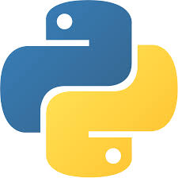

__What is Python?__ Python is a popular general purpose programming language used for both large and small-scale applications. Python’s wide-spread adoption is due in part to its large standard library, easy readability and support of multiple paradigms including functional, procedural and object-oriented programming styles. Python modules exist for interacting with a variety of databases making it an excellent choice for large-scale data analysis and the Python programming language is often the choice for introductory courses in data science and machine learning. If you've been wondering how to learn python online to advance your career, you've come to the right destination.

__Version__ : Python 3.8.5

__Different Links to learn Python from?__
* The following documentation is just like a pocket reference and can be used for placement preperations, but not for initial learning of python. It contains all the information for learning all the parts of it, Follow the original docs and keep this for reference.
* Get a Udemy Python certificate by finishing the paid course : [udemy](https://www.udemy.com/course/python-the-complete-python-developer-course/)
* Coursera Python certificate specializations : [coursera](https://www.coursera.org/search?query=python&index=prod_all_products_term_optimization&entityTypeDescription=Specializations&allLanguages=English&productDifficultyLevel=Beginner)
* Going on Now : https://www.learnpython.org/

__Python Programming Paradigms__
* Object Oriented
* Not Statically Typed

## Contents
* [Basics Tutorial](/python/basics)
* [Advanced Tutorial](/python/advanced)
* Data Science Packages